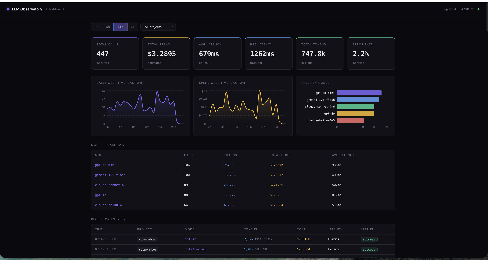

# LLM Observatory

**Real-time visibility into every AI API call your app makes — cost, speed, errors, and usage, all in one dashboard.**

<!-- Replace with your own screenshot: docs/dashboard.png -->


---

## The problem

When you build a product on top of AI APIs like OpenAI, Anthropic, or Google Gemini, you're essentially renting a brain by the token. Every call to the API costs money, takes time, and can fail — and in most codebases, none of that is tracked anywhere.

This creates a set of problems that compound fast:

- **You don't know what you're spending.** A single GPT-4o call can cost 10–50× more than GPT-4o-mini. If your app makes thousands of calls a day across multiple features, your bill at the end of the month can come as a complete surprise.
- **You don't know what's slow.** LLM calls can take anywhere from 200ms to 10+ seconds depending on the model, prompt length, and load. If one feature is silently taking 8 seconds per request, your users feel it — but you have no way to trace it back to the API call.
- **You don't know what's breaking.** API errors don't always surface cleanly. Rate limits, malformed prompts, and provider outages can cause silent failures that are hard to reproduce without a log of exactly what was sent and what came back.
- **You don't know what's working.** Without usage data, you can't tell which AI features are actually being used, which models are performing best, or where to invest your optimization effort.

Tools like Datadog and New Relic solve this for databases and HTTP requests. LLM Observatory solves it for AI API calls.

---

## What it does

LLM Observatory is a lightweight, self-hosted observability dashboard. You wrap your existing LLM calls with two lines of code, and every call gets logged and displayed in a live dashboard.

**Every logged call captures:**
- Model and provider (GPT-4o, Claude, Gemini, etc.)
- Token usage — prompt tokens, completion tokens, total
- Estimated cost in USD
- Latency — both average and P95 (the slowest 5% of calls)
- Success or error status, with the full error message if it failed

**The dashboard shows:**
- Live stat cards that refresh every 5 seconds
- Cost and call volume over time (1h / 6h / 24h / 7d windows)
- Breakdown by model — which models you're using most and what they cost
- A full call log with timestamps, project, tokens, and status
- Click any error row to open a detail drawer with the complete error message and call metadata

---

## Dashboard features

| Feature | Detail |
|---------|--------|
| Stat cards | Total calls, total spend, avg latency, **P95 latency**, total tokens, error rate |
| Time windows | 1h / 6h / 24h / 7d — chart granularity scales automatically |
| Error drawer | Click any error row → slide-in panel with full error, tokens, cost, latency |
| Model breakdown | Per-model call count, tokens, total cost, avg latency |
| Project filter | Scope all metrics to a single project/feature |
| Auto-refresh | Dashboard polls every 5 seconds — no page reload needed |

---

## Stack

| Layer | Tech |
|-------|------|
| Backend | FastAPI + SQLite |
| Frontend | Next.js 14 + TypeScript + Recharts + Tailwind |
| SDK | Python + TypeScript |
| Deploy | Vercel (frontend) + Render (backend) |

---

## Getting started

### 1. Clone and start the backend

```bash
git clone https://github.com/Mananjoshi2/llm-observatory
cd llm-observatory/backend
pip install -r requirements.txt
uvicorn main:app --reload
# Running at http://localhost:8000
```

### 2. Start the frontend

```bash
cd ../frontend
npm install
npm run dev
# Running at http://localhost:3000
```

### 3. Seed with demo data (optional)

```bash
cd ..
python seed.py
# Inserts 500 realistic fake LLM calls across multiple models and projects
```

Open [http://localhost:3000](http://localhost:3000) to see the dashboard.

---

## Instrument your code

Drop two lines into any file that makes LLM calls. The SDK handles timing, cost estimation, and logging automatically.

**Python:**

```python
from sdk.python.observatory import Observatory

obs = Observatory(project="my-app")

with obs.span(model="gpt-4o", provider="openai") as span:
    response = openai.chat.completions.create(
        model="gpt-4o",
        messages=[{"role": "user", "content": prompt}]
    )
    span.record(
        prompt_tokens=response.usage.prompt_tokens,
        completion_tokens=response.usage.completion_tokens,
    )
```

**TypeScript:**

```typescript
import { Observatory } from './sdk/typescript/observatory'

const obs = new Observatory({ project: 'my-app' })

const result = await obs.trace({
  model: 'claude-sonnet-4-6',
  provider: 'anthropic',
  fn: async (span) => {
    const res = await client.messages.create({ ... })
    span.record({
      promptTokens: res.usage.input_tokens,
      completionTokens: res.usage.output_tokens,
    })
    return res
  }
})
```

---

## Deployment

### Backend → Render

```bash
# 1. Connect your GitHub repo on render.com → New Web Service
# 2. Root Directory: backend
# 3. Build Command: pip install -r requirements.txt
# 4. Start Command: uvicorn main:app --host 0.0.0.0 --port $PORT
# 5. Instance Type: Free → Deploy
```

### Frontend → Vercel

```bash
# 1. Import the repo in Vercel
# 2. Set Root Directory to: frontend
# 3. Add environment variable:
NEXT_PUBLIC_API_URL=https://your-service.onrender.com
# 4. Deploy
```

> **Note on persistence:** SQLite resets on Render redeploy (free tier has no persistent disk). Run `python seed.py` once after deploying to populate demo data. Free instances also spin down after 15min inactivity — first request may take ~30s to cold start.

---

## Roadmap

- [ ] Alerts — email or Slack when cost spikes or error rate crosses a threshold
- [ ] Streaming token counting
- [ ] Multi-tenant auth — API keys scoped per project
- [ ] Export to CSV
- [ ] LangChain / LlamaIndex middleware
- [ ] Prompt diff viewer — compare prompt versions side by side
